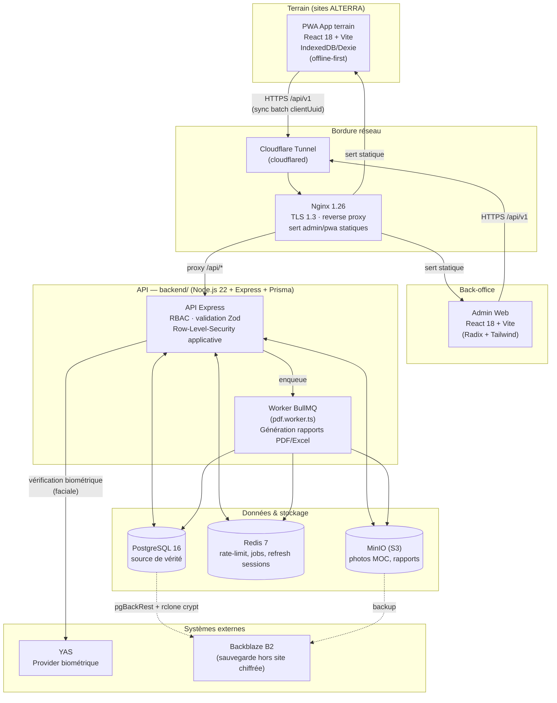
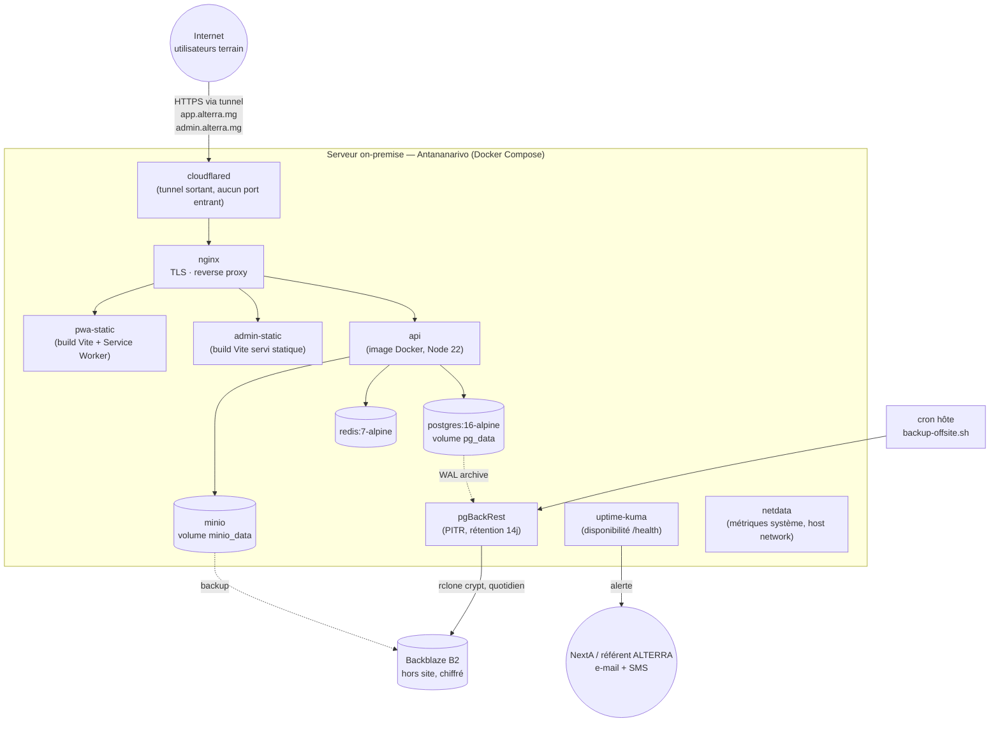
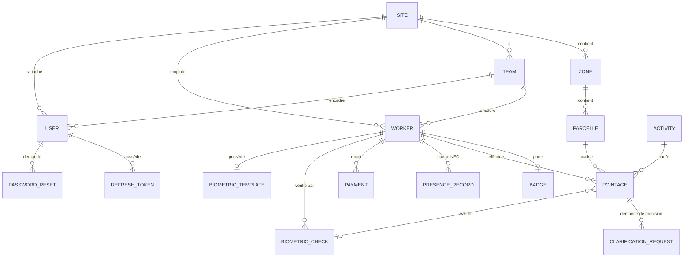
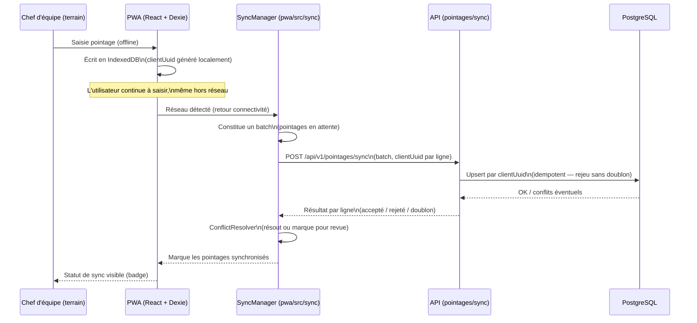

# ALTERRA — Document d'architecture technique

> Plateforme de suivi terrain (pointage journalier des MOC, validation, paie) — Antananarivo, Madagascar
> Version 1.0 — dernière mise à jour : 2026-08-12 (provider biométrique : YAS, remplace AXIAN)
> Sources : code du monorepo (`backend/`, `admin/`, `pwa/`, `infra/`), `basedocs/ALTERRA - Architecture de production (on-premise).md`, `docs/deploy/production.md`

## Sommaire

1. [Vue d'ensemble](#1-vue-densemble)
2. [Schéma d'architecture global](#2-schéma-darchitecture-global)
3. [Stack technique](#3-stack-technique)
4. [Structure du monorepo](#4-structure-du-monorepo)
5. [Architecture applicative](#5-architecture-applicative)
6. [Modèle de données](#6-modèle-de-données)
7. [Sécurité & autorisation](#7-sécurité--autorisation)
8. [Synchronisation offline-first](#8-synchronisation-offline-first)
9. [Architecture de déploiement](#9-architecture-de-déploiement)
10. [Observabilité, sauvegardes, CI/CD](#10-observabilité-sauvegardes-cicd)
11. [Risques et limites connues](#11-risques-et-limites-connues)

---

## 1. Vue d'ensemble

ALTERRA est une plateforme de gestion du pointage journalier de main-d'œuvre casuelle (MOC) sur des sites agricoles/industriels, avec calcul de paie à la tâche, validation hiérarchique et vérification biométrique. Trois applications composent le système :

| Application | Rôle | Utilisateurs |
| --- | --- | --- |
| **PWA terrain** (`pwa/`) | Saisie du pointage sur le terrain, **offline-first** (IndexedDB/Dexie), synchronisation par lots | Chefs d'équipe, Chefs de service (mobilité terrain) |
| **Back-office Admin** (`admin/`) | Pilotage : référentiels (sites, équipes, activités), validation, paie, rapports, audit | Chefs de service, Administrateurs |
| **API** (`backend/`) | Cœur métier unique : auth, RBAC, sync, calcul de paie, biométrie, rapports | Consommée par les deux fronts |

Le système est un **monolithe modulaire** (une seule API Express/Prisma), pas des microservices : justifié par le périmètre (5 sites, quelques centaines de MOC, une à deux dizaines d'utilisateurs simultanés). La complexité vient de la **connectivité intermittente terrain** (2G/3G/4G, coupures) plutôt que du volume.

---

## 2. Schéma d'architecture global

### 2.1 Vue conteneurs (C4 — niveau 2)



### 2.2 Vue déploiement (production on-premise)



### 2.3 Environnements

| Environnement | Où | Différences clés |
| --- | --- | --- |
| **Développement** | Poste dev, `docker-compose.yml` racine | Infra Docker (postgres/redis/minio) + apps en `npm run dev` (hot-reload tsx/Vite), ou stack complète avec `api` conteneurisé |
| **Staging** | VPS ou second Compose isolé | Même topologie que prod, données anonymisées, recette avant chaque mise en production |
| **Production** | Serveur on-premise Antananarivo | `infra/docker-compose.prod.yml` — nginx, cloudflared, postgres, redis, minio, pgBackRest, uptime-kuma, netdata |

---

## 3. Stack technique

| Couche | Technologie | Notes |
| --- | --- | --- |
| Langage | TypeScript strict (backend, admin, pwa) | `tsconfig.json` strict activé partout |
| API | Node.js 22 LTS, Express 4, Prisma 5 | Monolithe modulaire, ESM (`type: module`) |
| Validation | Zod | Schémas par route, middleware `validate.ts` |
| Auth | JWT (access court + refresh en cookie httpOnly), argon2, TOTP (`otplib`) | MFA obligatoire ADMIN |
| Base de données | PostgreSQL 16 | Enums natifs, `jsonb`, index composites |
| Cache / files | Redis 7 + BullMQ + ioredis | Rate limiting distribué, jobs async (PDF), sessions refresh |
| Stockage objet | MinIO (S3-compatible) | Photos MOC, rapports générés, URLs pré-signées |
| Génération documents | ExcelJS, Handlebars + Puppeteer (PDF) | `services/reports/`, job `pdf.worker.ts` |
| Logs | pino / pino-http | JSON structuré, requestId de corrélation |
| Front Admin | React 18 + Vite, Radix UI + Tailwind | Design system dans `components/ui/` |
| Front PWA | React 18 + Vite PWA, Dexie (IndexedDB) | Offline-first, Service Worker (Workbox) |
| Tests | Vitest + Supertest (backend), Playwright (e2e) | `e2e/` workspace dédié |
| Reverse proxy | Nginx 1.26 | TLS 1.3, HTTP/2, sert les fronts statiques |
| Exposition | Cloudflare Tunnel (`cloudflared`) | Aucun port entrant ouvert côté ALTERRA |
| Conteneurisation | Docker Compose (dev, staging, prod) | Images buildées via `backend/Dockerfile`, `admin/Dockerfile` |
| CI/CD | GitHub Actions | Lint + tests + build image ; déploiement à approbation manuelle |
| Sauvegarde | pgBackRest (PITR) + rclone crypt → Backblaze B2 | Stratégie 3-2-1 |
| Supervision | Uptime Kuma + Netdata + sonde externe | RPO 15 min / RTO 4h visés |

---

## 4. Structure du monorepo

npm workspaces (`backend`, `admin`, `pwa`, `e2e`) :

```
alterra/
├── backend/                    API Express + Prisma
│   ├── prisma/                 schema.prisma, migrations/, seed.ts
│   └── src/
│       ├── index.ts, app.ts    bootstrap + middlewares globaux
│       ├── routes/             21 routers (1 par domaine métier)
│       ├── middleware/         auth, rbac, prisma-rls, validate, audit.interceptor, error-handler
│       ├── services/           dashboard, reports, storage, biometric, payments, pointages,
│       │                       presence, activities, workflows, audit, notifications, users
│       ├── jobs/                pdf.worker.ts (BullMQ)
│       ├── lib/                 jwt, prisma, redis, logger, geo-json, nfc-tag, period-iso, week-iso
│       └── __tests__/          intégration vitest + supertest
│
├── admin/                      Back-office React 18 + Vite
│   └── src/
│       ├── pages/, components/ activities, audit, auth, dashboard, layout, map,
│       │                       payments, pointages, reports, requests, shared, ui, workers
│       └── hooks/, lib/
│
├── pwa/                         App terrain React 18 + Vite PWA
│   └── src/
│       ├── components/         auth, nav, pointage, sync, ui, validation
│       ├── db/                 schéma Dexie (IndexedDB)
│       ├── sync/                SyncManager, ReferentialSync, PresenceSync, ConflictResolver
│       ├── services/biometric/  capture/vérif biométrique côté client
│       └── hooks/, lib/, pages/, types/
│
├── infra/                       Déploiement (versionné, reconstructible depuis Git)
│   ├── docker-compose.prod.yml, docker-compose.staging.yml
│   ├── nginx/                   nginx.conf, nginx.staging.conf
│   ├── cloudflared/config.yml
│   ├── pgbackrest/pgbackrest.conf
│   ├── scripts/                 deploy.sh, rollback.sh, backup-offsite.sh, restore.sh,
│   │                            setup-vps.sh, certbot-init.sh, smoke-test.sh, install-cron.sh
│   └── secrets/                 non versionné (.gitignore)
│
├── e2e/                          Tests Playwright bout-en-bout
├── docs/                         Runbook, guides, ops, qa, cadrage
└── docker-compose.yml            Stack dev locale
```

---

## 5. Architecture applicative

### 5.1 Backend — organisation en couches


Domaines de routes (`backend/src/routes/`) : `auth`, `sites`, `zones`, `parcels`, `teams`, `workers`, `users`, `activities`, `pointages`, `presence`, `badges`, `payments`, `biometric` / `biometric-templates`, `dashboard`, `reports`, `daily-reports`, `workflows`, `audit`, `health`.

Chaque route délègue à un service (`services/<domaine>/`) — les routes restent minces (parsing + validation Zod + appel service + réponse HTTP), la logique métier est testable indépendamment d'Express.

### 5.2 Chaîne de requête (middleware)

`app.ts` compose, dans l'ordre : `helmet` → `cors` (origines `ADMIN_ORIGIN`/`PWA_ORIGIN`) → `express.json` (limite 2 Mo) → `cookie-parser` → `requestContext` (AsyncLocalStorage, alimente le RLS applicatif) → `pino-http` → rate limiting différencié par route → `auditSensitiveRoutes` → routeur API → `notFoundHandler` → `errorHandler`.

Rate limiting à trois profils :
- `/api/v1/auth` : strict (10 req / 5 min en prod) — anti-bruteforce
- `/api/v1/pointages/sync` : large (60 req / min) — ne jamais pénaliser une resynchronisation massive après coupure terrain
- `/api/v1` (défaut) : 1000 req / min

### 5.3 Frontends

- **Admin** : SPA React classique, consomme l'API via un client HTTP (axios), state d'auth en store dédié (`lib/auth-store`), composants métier organisés par domaine (`pointages/`, `payments/`, `reports/`, `audit/`…), carte des sites (`map/`).
- **PWA** : même stack React/Vite, mais avec persistance locale Dexie (`db/`) qui reflète un sous-ensemble du schéma serveur (référentiels + pointages en attente de sync), Service Worker pour l'app-shell, et un module `sync/` dédié (détaillé §8).

---

## 6. Modèle de données

Schéma Prisma (`backend/prisma/schema.prisma`) — entités principales et relations :



### 6.1 Entités clés

| Entité | Rôle |
| --- | --- |
| `User` | Comptes back-office/PWA — rôle `ADMIN` \| `CHEF_SERVICE` \| `CHEF_EQUIPE`, rattaché à un site et/ou une équipe, MFA TOTP optionnelle |
| `Site` | Lieu d'intervention (5 sites cible) |
| `Zone` / `Parcelle` | Découpage géographique du site (V2, GeoJSON) |
| `Team` | Équipe de terrain, rattachée à un site, encadrée par un chef |
| `Worker` | MOC (main-d'œuvre casuelle) — matricule, numéro Mvola, statut, photo KYC |
| `Activity` | Type de tâche tarifée (unité + taux, validité temporelle, éventuellement scopée à un site) |
| `Pointage` | Ligne de pointage : quantité × tarif figé (`unitRateSnapshot`) = montant, idempotent via `clientUuid` unique, statut de workflow (`PENDING`/`VALIDATED`/`REJECTED`/`NEEDS_CLARIFICATION`) |
| `PresenceRecord` | Pointage de présence par badge NFC (V2) |
| `BiometricCheck` / `BiometricTemplate` | Vérification faciale (provider YAS / manuel / mock / local offline) |
| `Payment` | Paie calculée par cycle (hebdo/quotidien), traçabilité de correction manuelle |
| `ActivityRequest` / `WorkerRequest` / `ClarificationRequest` | Workflows de demande/validation (ajout d'activité, ajout de MOC, clarification de pointage) |
| `AuditLog` | Journal d'audit générique (avant/après en JSON), indépendant de l'entité |
| `RefreshToken` / `PasswordReset` | Cycle de vie des sessions et de la récupération de compte |

### 6.2 Points de conception notables

- **Idempotence** : `Pointage.clientUuid` (unique) est généré côté PWA à la saisie — rejoué en cas de resynchronisation sans créer de doublon. C'est le mécanisme central qui rend le mode offline sûr.
- **Tarif figé** : `unitRateSnapshot` et `amount` sont calculés et stockés au moment de la saisie, pas recalculés dynamiquement — un changement de tarif d'`Activity` n'affecte jamais les pointages déjà saisis.
- **Traçabilité paie** : `Payment.correctionReason` + `originalAmount` permettent une correction manuelle auditable sans perdre la valeur d'origine.
- **Suppression douce** : `deletedAt` sur `User` et `Worker` (pas de suppression physique sur les entités porteuses d'historique de paie).

---

## 7. Sécurité & autorisation

- **AuthN** : JWT access token courte durée + refresh token en cookie `httpOnly`, mots de passe hashés argon2, MFA TOTP obligatoire pour `ADMIN` (recommandé pour `CHEF_SERVICE`).
- **AuthZ (RBAC)** : trois rôles (`ADMIN`, `CHEF_SERVICE`, `CHEF_EQUIPE`), appliqués via `requireRole()` par route.
- **Cloisonnement par site/équipe** : `siteScope()` / `teamScope()` (middleware `rbac.ts`) + **Row-Level-Security applicative** — une extension Prisma (`prisma-rls.ts`) injecte automatiquement le filtre `siteId`/`teamId` du contexte de requête (`AsyncLocalStorage`) sur les modèles sensibles (`Worker`, `Pointage`, `Payment`, `Team`, `User`), sur lecture *et* écriture, avec un filtre "impossible" en garde-fou si le contexte est absent.
- **Audit** : `auditSensitiveRoutes` intercepte les routes sensibles et alimente `AuditLog` (diff avant/après, IP, user-agent) — consultable en lecture seule côté admin.
- **Transport & durcissement (prod)** : TLS 1.3 partout, HSTS, aucun service de données (Postgres/Redis/MinIO) exposé hors du réseau Docker interne, secrets montés en fichiers Docker (jamais en variables d'environnement commitées).
- **Exposition Internet** : Cloudflare Tunnel — connexion sortante uniquement depuis le serveur, aucun port entrant ouvert côté ALTERRA ; alternative documentée : IP fixe + redirection de ports (moins recommandée, dépendance opérateur unique).
- **Conformité** : loi malgache n° 2014-038 sur la protection des données — hébergement on-premise sur le territoire, sauvegardes hors site chiffrées avant envoi (le prestataire tiers ne voit jamais de clair).

Détails complets (durcissement système, rotation des secrets, conformité) : voir `basedocs/ALTERRA - Architecture de production (on-premise).md` §6.

---

## 8. Synchronisation offline-first

Cœur différenciant de la PWA terrain : saisie garantie même sans réseau, synchronisation par lots dès que la connectivité revient.



Modules PWA impliqués (`pwa/src/sync/`) :

| Fichier | Rôle |
| --- | --- |
| `SyncManager.ts` | Orchestration des lots, détection réseau, retry |
| `ReferentialSync.ts` | Descente des référentiels (sites, activités, workers) vers Dexie |
| `PresenceSync.ts` | Synchronisation des pointages de présence NFC |
| `ConflictResolver.ts` | Résolution des conflits (doublon, rejet serveur) |

Côté serveur, la route `pointages/sync` a un rate limit large dédié (§5.2) précisément pour absorber une resynchronisation massive après une coupure prolongée — un incident métier attendu, pas une exception.

---

## 9. Architecture de déploiement

Voir schéma §2.2. Résumé des choix :

| Sujet | Choix | Raison |
| --- | --- | --- |
| Hébergement | Serveur on-premise, Antananarivo | Souveraineté des données, conformité loi 2014-038 |
| Exposition | Cloudflare Tunnel (sortant uniquement) | Pas d'IP fixe nécessaire, pas de port entrant, TLS + anti-DDoS inclus |
| Conteneurisation | Docker Compose | Reconstructible depuis Git seul ; chaque service remplaçable indépendamment |
| Base de données | PostgreSQL 16, volume dédié | WAL archivé pour PITR |
| Fichiers | MinIO + URLs pré-signées (15 min) | Pas de fichiers servis directement par Express ; contrôle d'accès par rôle |
| Résilience élec./réseau | Onduleur en ligne + bascule 4G | Le délestage est un évènement normal à Antananarivo — le mode offline de la PWA absorbe l'indisponibilité |

Le dimensionnement, les coûts indicatifs, le plan de mise en production (phases, ~20 j-h) et l'analyse de risques détaillée figurent dans `basedocs/ALTERRA - Architecture de production (on-premise).md` (§8, §11–13) — ce document technique n'en duplique que la substance architecturale.

---

## 10. Observabilité, sauvegardes, CI/CD

- **Logs** : pino JSON → stdout → collecte Docker (rotation, rétention 90 j), corrélation par `requestId`.
- **Supervision** : Uptime Kuma (interne, `/health` API/admin/PWA) + sonde externe (détecte une panne du tunnel vue du terrain) ; Netdata pour les métriques système (CPU/RAM/disque/I/O Postgres).
- **Sauvegardes (3-2-1)** : pgBackRest en local (PITR, rétention 14 j) + copie chiffrée quotidienne hors site (rclone → Backblaze B2, 30 j + 12 mensuelles) + copie froide mensuelle sur disque USB. RPO visé 15 min, RTO visé 4h ouvrées. Chaque job notifie un healthcheck externe — l'absence de notification est l'alerte.
- **CI/CD** : GitHub Actions — lint + tests (Vitest, Playwright) + build d'image à chaque push ; déploiement en production à approbation manuelle, images taguées par SHA sur GHCR ; `infra/scripts/deploy.sh` / `rollback.sh` pour le déploiement/retour arrière ; migrations Prisma appliquées en étape explicite avant bascule, avec sauvegarde automatique juste avant.

---

## 11. Risques et limites connues

| Risque | Mitigation en place |
| --- | --- |
| Coupures électriques/réseau fréquentes (Antananarivo) | Onduleur, bascule 4G, mode offline PWA absorbe l'indisponibilité |
| Sinistre serveur (panne/vol/incendie) | Sauvegardes 3-2-1 chiffrées, restauration testée mensuellement sur VPS de secours |
| Conflit de sync après longue coupure terrain | Idempotence par `clientUuid`, rate limit dédié, `ConflictResolver` |
| Croissance au-delà du périmètre actuel (5 sites) | Postgres/MinIO scalent verticalement ; architecture conteneurisée portable vers VPS/serveur plus gros sans réécriture |
| Dépendance à un provider biométrique externe (YAS) | Fallback `MANUAL` / `MOCK` / `LOCAL_OFFLINE` dans l'enum `BioProvider` |

---

*Document vivant — à maintenir en synchronisation avec le code (`backend/prisma/schema.prisma`, `infra/*.yml`) à chaque évolution structurante.*
