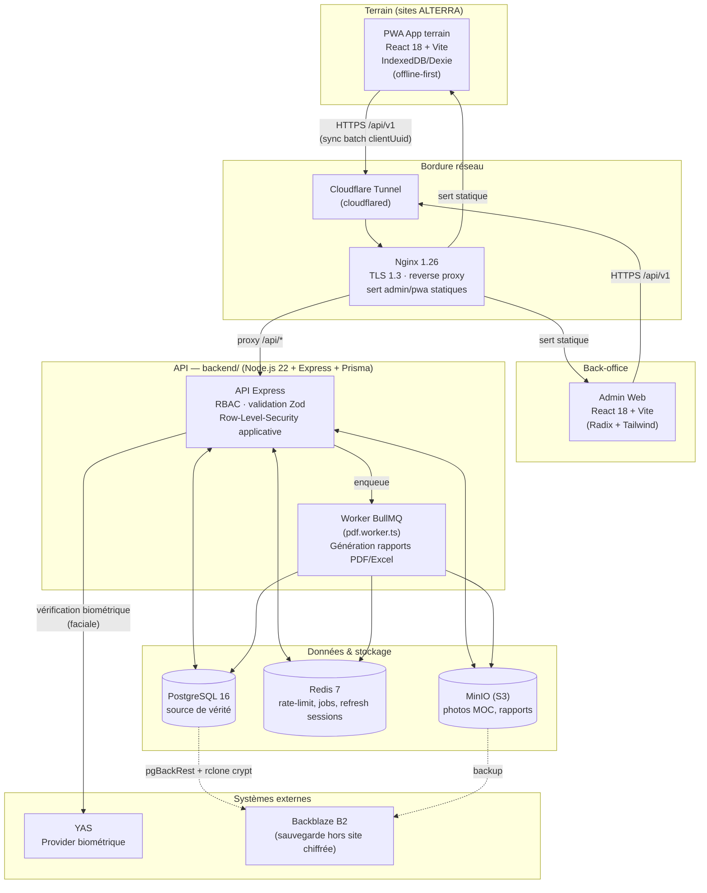
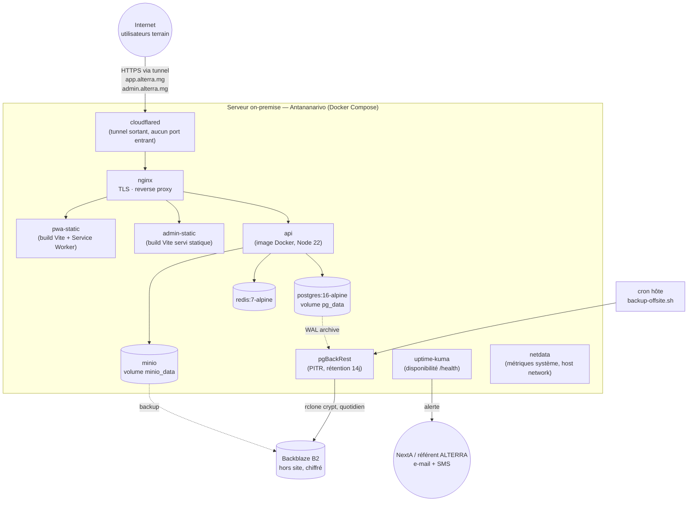
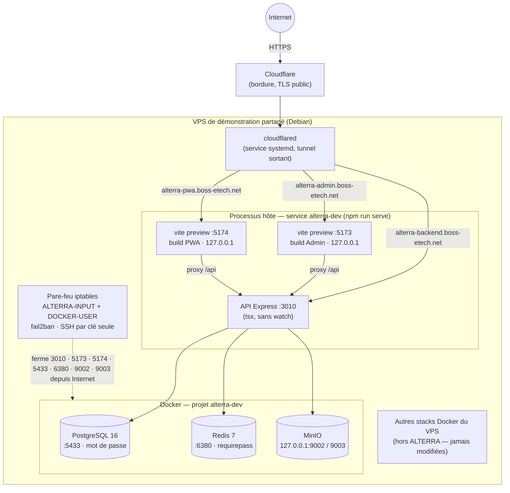
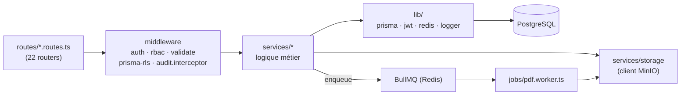

# ALTERRA — Document d'architecture technique

> Plateforme de suivi terrain (pointage journalier des MOC, validation, paie) — Antananarivo, Madagascar
> Version 1.1 — dernière mise à jour : 2026-09-20
> Évolutions depuis la 1.0 (2026-08-12) : référentiel d'activités en catégories / sous-activités / unités, réconciliation des paiements MVola, réglages d'application (nom et icône), sauvegarde/restauration depuis l'Admin, actions par lot et export dans les tableaux, durcissement de sécurité et de l'exposition du VPS de démonstration (incident du 20 septembre 2026, voir §7.3 et §9.2).
> Sources : code du monorepo (`backend/`, `admin/`, `pwa/`, `infra/`), `basedocs/ALTERRA - Architecture de production (on-premise).md`, `docs/deploy/production.md`

## Sommaire

1. [Vue d'ensemble](#1-vue-densemble)
2. [Schéma d'architecture global](#2-schéma-darchitecture-global)
3. [Stack technique](#3-stack-technique)
4. [Structure du monorepo](#4-structure-du-monorepo)
5. [Architecture applicative](#5-architecture-applicative)
6. [Modèle de données](#6-modèle-de-données)
7. [Sécurité & autorisation](#7-sécurité--autorisation)
8. [Synchronisation offline-first](#8-synchronisation-offline-first)
9. [Architecture de déploiement](#9-architecture-de-déploiement)
10. [Observabilité, sauvegardes, CI/CD](#10-observabilité-sauvegardes-cicd)
11. [Risques et limites connues](#11-risques-et-limites-connues)

---

## 1. Vue d'ensemble

ALTERRA est une plateforme de gestion du pointage journalier de main-d'œuvre casuelle (MOC) sur des sites agricoles/industriels, avec calcul de paie à la tâche, validation hiérarchique et vérification biométrique. Trois applications composent le système :

| Application | Rôle | Utilisateurs |
| --- | --- | --- |
| **PWA terrain** (`pwa/`) | Saisie du pointage sur le terrain, **offline-first** (IndexedDB/Dexie), synchronisation par lots | Chefs d'équipe, Chefs de service (mobilité terrain) |
| **Back-office Admin** (`admin/`) | Pilotage : référentiels (sites, zones, activités, unités, travailleurs), validation, paie et réconciliation MVola, rapports, audit, réglages (nom/icône, sauvegarde de la base) | Chefs de service, Administrateurs |
| **API** (`backend/`) | Cœur métier unique : auth, RBAC, sync, calcul de paie, biométrie, rapports | Consommée par les deux fronts |

Le système est un **monolithe modulaire** (une seule API Express/Prisma), pas des microservices : justifié par le périmètre (5 sites, quelques centaines de MOC, une à deux dizaines d'utilisateurs simultanés). La complexité vient de la **connectivité intermittente terrain** (2G/3G/4G, coupures) plutôt que du volume.

---

## 2. Schéma d'architecture global

### 2.1 Vue conteneurs (C4 — niveau 2)



### 2.2 Vue déploiement (production on-premise)



### 2.3 Environnements

| Environnement | Où | Différences clés |
| --- | --- | --- |
| **Développement** | Poste dev, `docker-compose.yml` racine | Infra Docker (postgres/redis/minio) + apps en `npm run dev` (hot-reload tsx/Vite), ou stack complète avec `api` conteneurisé. **Le mode `npm run dev` ne doit jamais être exposé sur Internet** (voir §7.3) |
| **Démonstration / dev public** | VPS Debian partagé, tunnel Cloudflare `boss-etech.net` | API en `tsx` (sans watch), frontends **construits** et servis par `vite preview` sur `127.0.0.1`, infra Docker, pare-feu + fail2ban. Détail §2.4 et §9.2 |
| **Staging** | VPS ou second Compose isolé | Même topologie que prod, données anonymisées, recette avant chaque mise en production |
| **Production** | Serveur on-premise Antananarivo | `infra/docker-compose.prod.yml` — nginx, cloudflared, postgres, redis, minio, pgBackRest, uptime-kuma, netdata |

### 2.4 Vue de l'environnement de démonstration (VPS partagé)



Le tunnel se connecte en **loopback** : rien n'a besoin d'être joignable depuis Internet. Un serveur de dev (`vite`) n'est jamais derrière le tunnel : il sert les sources du projet.

---

## 3. Stack technique

| Couche | Technologie | Notes |
| --- | --- | --- |
| Langage | TypeScript strict (backend, admin, pwa) | `tsconfig.json` strict activé partout |
| API | Node.js 22 LTS, Express 4, Prisma 5 | Monolithe modulaire, ESM (`type: module`) |
| Validation | Zod | Schémas par route, middleware `validate.ts` |
| Auth | JWT (access court + refresh en cookie httpOnly, rotation atomique + liste noire Redis), argon2, TOTP (`otplib`), verrouillage par e-mail | TOTP demandé à la connexion dès qu'un ADMIN est enrôlé ; l'enrôlement n'est pas imposé (écart avec la cible « MFA obligatoire », voir §11) |
| Base de données | PostgreSQL 16 | Enums natifs, `jsonb`, index composites |
| Cache / files | Redis 7 + BullMQ + ioredis | Jobs async (PDF), liste noire des refresh tokens, compteurs de verrouillage de connexion ; mot de passe obligatoire hors poste local |
| Stockage objet | MinIO (S3-compatible) | Photos MOC, rapports générés, icône de l'application, dépôt temporaire des fichiers de restauration ; buckets privés, URLs pré-signées |
| Génération documents | ExcelJS, Handlebars + Puppeteer (PDF) | `services/reports/`, job `pdf.worker.ts` |
| Logs | pino / pino-http | JSON structuré, requestId de corrélation |
| Front Admin | React 18 + Vite, Radix UI + Tailwind | Design system dans `components/ui/` |
| Front PWA | React 18 + Vite PWA, Dexie (IndexedDB) | Offline-first, Service Worker (Workbox) |
| Tests | Vitest + Supertest (backend), Playwright (e2e) | `e2e/` workspace dédié |
| Reverse proxy | Nginx 1.26 | TLS 1.3, HTTP/2, sert les fronts statiques |
| Exposition | Cloudflare Tunnel (`cloudflared`) | Aucun port entrant ouvert côté ALTERRA |
| Conteneurisation | Docker Compose (dev, staging, prod) | Images buildées via `backend/Dockerfile` (inclut `postgresql16-client` pour la sauvegarde applicative), `admin/Dockerfile` |
| CI/CD | GitHub Actions | Lint + tests + build image ; déploiement à approbation manuelle |
| Sauvegarde | pgBackRest (PITR) + rclone crypt → Backblaze B2 | Stratégie 3-2-1. S'y ajoute un instantané à la demande depuis l'Admin (`pg_dump -Fc` / `pg_restore`, §7.3) |
| Supervision | Uptime Kuma + Netdata + sonde externe | RPO 15 min / RTO 4h visés |

---

## 4. Structure du monorepo

npm workspaces (`backend`, `admin`, `pwa`, `e2e`) :

```
alterra/
├── backend/                    API Express + Prisma
│   ├── prisma/                 schema.prisma, migrations/, seed.ts
│   └── src/
│       ├── index.ts, app.ts    bootstrap + middlewares globaux
│       ├── routes/             22 routers (1 par domaine métier)
│       ├── middleware/         auth, rbac, prisma-rls, validate, audit.interceptor, error-handler
│       ├── services/           dashboard, reports, storage, biometric, payments (MVola : export,
│       │                       relevé, classification, réconciliation), pointages, presence, activities,
│       │                       workflows, audit, notifications, users, auth, import (Excel)
│       ├── jobs/                pdf.worker.ts (BullMQ)
│       ├── lib/                 jwt, prisma, redis, logger (masquage des secrets), login-lockout,
│       │                       security-config (garde des secrets), bulk, geo-json, nfc-tag, period-iso, week-iso
│       ├── assets/              default-icon.ts (icône par défaut embarquée en base64)
│       └── __tests__/          intégration vitest + supertest (29 fichiers)
│
├── admin/                      Back-office React 18 + Vite
│   └── src/
│       ├── pages/, components/ activities, audit, auth, dashboard, layout, map,
│       │                       payments, pointages, reports, requests, shared, ui, workers
│       │                       (ui/data-table : tri, sélection, actions par lot, export Excel)
│       └── hooks/, lib/
│
├── pwa/                         App terrain React 18 + Vite PWA
│   └── src/
│       ├── components/         auth, nav, pointage, sync, ui, validation
│       ├── db/                 schéma Dexie (IndexedDB)
│       ├── sync/                SyncManager, ReferentialSync, PresenceSync, ConflictResolver
│       ├── services/biometric/  capture/vérif biométrique côté client
│       └── hooks/, lib/, pages/, types/
│
├── infra/                       Déploiement (versionné, reconstructible depuis Git)
│   ├── docker-compose.prod.yml, docker-compose.staging.yml
│   ├── nginx/                   nginx.conf, nginx.staging.conf
│   ├── cloudflared/             config.yml (prod), config.dev.yml (VPS de démonstration)
│   ├── pgbackrest/pgbackrest.conf
│   ├── systemd/                 alterra-dev.service, alterra-firewall.service, cloudflared-dev.service
│   ├── scripts/                 deploy.sh, rollback.sh, backup-offsite.sh, restore.sh, setup-vps.sh,
│   │                            certbot-init.sh, smoke-test.sh, install-cron.sh ;
│   │                            VPS de démonstration : deploy-dev.sh, firewall-dev.sh, harden-host.sh,
│   │                            rotate-secrets.sh, rotate-infra-secrets.sh
│   └── secrets/                 non versionné (.gitignore)
│
├── e2e/                          Tests Playwright bout-en-bout
├── docs/                         Runbook, guides, ops, qa, cadrage
└── docker-compose.yml            Stack dev locale
```

---

## 5. Architecture applicative

### 5.1 Backend — organisation en couches



Domaines de routes (`backend/src/routes/`) : `auth`, `sites`, `zones`, `parcels`, `teams`, `workers`, `users`, `activities` (catégories, sous-activités, unités), `pointages`, `presence`, `badges`, `payments` (génération, export MVola, import du relevé), `biometric` / `biometric-templates`, `dashboard`, `reports`, `daily-reports`, `workflows`, `audit`, `app-settings` (nom, icône, manifest PWA), `system` (sauvegarde / restauration de la base), `health`.

Actions par lot : les routes `…/bulk-*` (sites, travailleurs, zones, parcelles, pointages, demandes, sous-activités) partagent l'helper `lib/bulk.ts` — exécution ligne par ligne, résultat `{ id, status, error? }` par élément, sans transaction globale (un échec métier ne bloque pas le reste du lot).

Chaque route délègue à un service (`services/<domaine>/`) — les routes restent minces (parsing + validation Zod + appel service + réponse HTTP), la logique métier est testable indépendamment d'Express.

### 5.2 Chaîne de requête (middleware)

`app.ts` compose, dans l'ordre : `trust proxy` (nombre de sauts = `TRUST_PROXY_HOPS`) → `helmet` → `cors` (origines `ADMIN_ORIGIN`/`PWA_ORIGIN`) → `express.json` (limite 2 Mo) → `cookie-parser` → `requestContext` (AsyncLocalStorage, alimente le RLS applicatif) → `pino-http` (en-têtes `Authorization`, cookies et `set-cookie` masqués) → rate limiting différencié par route → `auditSensitiveRoutes` → routeur API → `notFoundHandler` → `errorHandler` (les détails d'erreur ne sont renvoyés au client que pour les 4xx).

Rate limiting à trois profils :
- `/api/v1/auth` : strict (10 req / 5 min en prod, 100 hors prod) — anti-bruteforce, complété par un verrouillage par e-mail (§7)
- `/api/v1/pointages/sync` : large (60 req / min) — ne jamais pénaliser une resynchronisation massive après coupure terrain
- `/api/v1` (défaut) : 1000 req / min

### 5.3 Frontends

- **Admin** : SPA React classique, consomme l'API via un client HTTP (axios), state d'auth en store dédié (`lib/auth-store`), composants métier organisés par domaine (`pointages/`, `payments/`, `reports/`, `audit/`…), carte des sites (`map/`, dessin de zones/parcelles). Les tableaux partagent des primitives communes (`ui/data-table/` : tri client ou serveur selon la pagination, sélection multiple, barre d'actions par lot, export Excel généré dans le navigateur). La page **Paramètres** porte le nom et l'icône de l'application ainsi que la sauvegarde/restauration de la base.
- **PWA** : même stack React/Vite, mais avec persistance locale Dexie (`db/`) qui reflète un sous-ensemble du schéma serveur (référentiels + pointages en attente de sync), Service Worker pour l'app-shell, et un module `sync/` dédié (détaillé §8).
- **Nom et icône dynamiques** : le nom de l'application, son icône et le manifest de la PWA sont servis par l'API (`GET /api/v1/app-settings`, `/app-settings/icon`, `/manifest.webmanifest`, publics car nécessaires avant connexion). Les `<link rel="manifest">` et l'icône des deux frontends pointent vers ces routes ; la modification se fait depuis l'Admin (`AppSetting`, ligne unique).

---

## 6. Modèle de données

Schéma Prisma (`backend/prisma/schema.prisma`) — entités principales et relations :

```mermaid
erDiagram
    SITE ||--o{ ZONE : "contient"
    SITE ||--o{ TEAM : "a"
    SITE ||--o{ WORKER : "emploie"
    SITE ||--o{ USER : "rattache"
    ZONE ||--o{ PARCELLE : "contient"
    TEAM ||--o{ WORKER : "encadre"
    TEAM ||--o{ USER : "encadre"
    WORKER ||--o| BADGE : "porte"
    WORKER ||--o{ POINTAGE : "effectue"
    WORKER ||--o{ PRESENCE_RECORD : "badge NFC"
    WORKER ||--o{ PAYMENT : "reçoit"
    WORKER ||--o{ BIOMETRIC_CHECK : "vérifié par"
    WORKER ||--o| BIOMETRIC_TEMPLATE : "possède"
    ACTIVITY_CATEGORY ||--o{ ACTIVITY_SUB_ACTIVITY : "regroupe"
    UNIT ||--o{ ACTIVITY_SUB_ACTIVITY : "unité de facturation"
    ACTIVITY_SUB_ACTIVITY ||--o{ POINTAGE : "tarife"
    ACTIVITY_CATEGORY ||--o{ ACTIVITY_REQUEST : "demandée dans"
    UNIT ||--o{ ACTIVITY_REQUEST : "unité demandée"
    PARCELLE ||--o{ POINTAGE : "localise"
    POINTAGE ||--o{ CLARIFICATION_REQUEST : "demande de précision"
    POINTAGE }o--o| BIOMETRIC_CHECK : "valide"
    USER ||--o{ REFRESH_TOKEN : "possède"
    USER ||--o{ PASSWORD_RESET : "demande"```

### 6.1 Entités clés

| Entité | Rôle |
| --- | --- |
| `User` | Comptes back-office/PWA — rôle `ADMIN` \| `CHEF_SERVICE` \| `CHEF_EQUIPE`, rattaché à un site et/ou une équipe, MFA TOTP optionnelle |
| `Site` | Lieu d'intervention (5 sites cible) |
| `Zone` / `Parcelle` | Découpage géographique du site (V2, GeoJSON) |
| `Team` | Équipe de terrain, rattachée à un site, encadrée par un chef |
| `Worker` | MOC (main-d'œuvre casuelle) — matricule, numéro Mvola, statut, photo KYC |
| `ActivityCategory` | Catégorie officielle (ACT01 à ACT07), globale à tous les sites |
| `Unit` | Référentiel des unités de facturation (pièce, trou, ha, km, jour…) |
| `ActivitySubActivity` | Ce qui est réellement pointé et facturé : libellé complet + libellé court (grammaire des libellés MVola), unité, tarif, validité temporelle (`validFrom` / `validTo`), surcharge éventuelle par site (`siteId`). `groupKey` relie la ligne globale et ses surcharges de site d'une même tâche |
| `Pointage` | Ligne de pointage : quantité × tarif figé (`unitRateSnapshot`) = montant, idempotent via `clientUuid` unique, statut de workflow (`PENDING`/`VALIDATED`/`REJECTED`/`NEEDS_CLARIFICATION`) |
| `PresenceRecord` | Pointage de présence par badge NFC (V2) |
| `BiometricCheck` / `BiometricTemplate` | Vérification faciale (provider YAS / manuel / mock / local offline) |
| `Payment` | Paie calculée par cycle (hebdo/quotidien), traçabilité de correction manuelle, référence et date d'exécution MVola, statut de réconciliation avec le relevé (`CONFIRME`, `ECART_MONTANT`, `ORPHELIN`, `NON_CONFIRME`) |
| `ActivityRequest` / `WorkerRequest` / `ClarificationRequest` | Workflows de demande/validation (ajout d'activité, ajout de MOC, clarification de pointage) |
| `AuditLog` | Journal d'audit générique (avant/après en JSON), indépendant de l'entité |
| `RefreshToken` / `PasswordReset` | Cycle de vie des sessions et de la récupération de compte |
| `AppSetting` | Ligne unique (`id = "singleton"`) : nom de l'application et clé MinIO de l'icône |

### 6.2 Points de conception notables

- **Idempotence** : `Pointage.clientUuid` (unique) est généré côté PWA à la saisie — rejoué en cas de resynchronisation sans créer de doublon. C'est le mécanisme central qui rend le mode offline sûr.
- **Tarif figé** : `unitRateSnapshot` et `amount` sont calculés et stockés au moment de la saisie, pas recalculés dynamiquement — un changement de tarif d'une sous-activité n'affecte jamais les pointages déjà saisis.
- **Tarifs versionnés (RG-04)** : une modification de tarif clôt la ligne courante (`validTo`) et en ouvre une nouvelle. Une contrainte partielle posée en migration (Postgres ne l'exprime pas via `@@unique`) garantit au plus une ligne courante par couple (`groupKey`, `siteId`).
- **Traçabilité paie** : `Payment.correctionReason` + `originalAmount` permettent une correction manuelle auditable sans perdre la valeur d'origine.
- **Suppression douce** : `deletedAt` sur `User` et `Worker` (pas de suppression physique sur les entités porteuses d'historique de paie).

---

## 7. Sécurité & autorisation

### 7.1 Authentification et autorisation

- **AuthN** : JWT d'accès de courte durée (15 min, HS256) + refresh token de 7 jours en cookie `httpOnly`, `sameSite=strict` et `Secure` (sauf en test). Le refresh est **rotatif** (rotation atomique, jeton précédent placé en liste noire Redis). Mots de passe hashés argon2id. TOTP : demandé à la connexion dès qu'un ADMIN est enrôlé ; l'enrôlement lui-même n'est pas imposé (§11).
- **Anti-bruteforce** : rate limit sur `/api/v1/auth` (10 req / 5 min en production) **et** verrouillage par adresse e-mail, comptes inconnus inclus : 10 échecs en 15 min (`lib/login-lockout.ts`, compteurs Redis), échecs MFA compris. Un compte inconnu déclenche quand même une vérification argon2 factice : le temps de réponse ne permet pas d'énumérer les comptes.
- **AuthZ (RBAC)** : trois rôles (`ADMIN`, `CHEF_SERVICE`, `CHEF_EQUIPE`), appliqués via `requireRole()` par route. Seules les routes publiques voulues n'ont pas de garde : `health`, connexion / rafraîchissement, `app-settings` en lecture et le manifest.
- **Cloisonnement par site/équipe** : `siteScope()` / `teamScope()` (middleware `rbac.ts`) + **Row-Level-Security applicative** — une extension Prisma (`prisma-rls.ts`) injecte automatiquement le filtre `siteId`/`teamId` du contexte de requête (`AsyncLocalStorage`) sur les modèles sensibles (`Worker`, `Pointage`, `Payment`, `Team`, `User`), sur lecture *et* écriture, avec un filtre "impossible" en garde-fou si le contexte est absent. Les jobs PDF portent le site du rapport : un chef de service ne peut consulter que les siens (404 sinon).
- **Audit** : `auditSensitiveRoutes` intercepte les routes sensibles et alimente `AuditLog` (diff avant/après, IP, user-agent) — consultable en lecture seule côté admin. L'IP enregistrée est celle du client réel : `TRUST_PROXY_HOPS` doit valoir le nombre de reverse proxies devant l'API (1 avec nginx, 2 avec cloudflared → `vite preview` → API).
- **Journaux** : les en-têtes `Authorization`, les cookies et `set-cookie` sont masqués (`[redacted]`) par pino.

### 7.2 Secrets, données et fichiers

- **Secrets** : au démarrage, `lib/security-config.ts` compare `JWT_SECRET`, `JWT_REFRESH_SECRET`, `MFA_ENCRYPTION_KEY`, `MINIO_ACCESS_KEY` et `MINIO_SECRET_KEY` aux valeurs du `.env.example` public : arrêt immédiat en production, erreur bruyante sinon. Rotation : `infra/scripts/rotate-secrets.sh` (JWT, MFA, sessions, mot de passe admin) et `infra/scripts/rotate-infra-secrets.sh` (Postgres, Redis, MinIO). `backend/.env` reste en `600`.
- **Fichiers** : buckets MinIO privés, URLs pré-signées de 15 min, aucun fichier servi directement par Express — sauf l'icône de l'application, relayée par l'API avec `Content-Security-Policy: sandbox` et `nosniff` (un SVG ouvert directement ne peut pas s'exécuter dans l'origine de l'API) ; taille et existence de l'objet vérifiées côté serveur à la confirmation.
- **Sauvegarde et restauration depuis l'Admin** (`routes/system.routes.ts`, ADMIN uniquement ; la sauvegarde et la restauration sont inscrites au journal d'audit) :
  - sauvegarde = `pg_dump -Fc` (format custom, flux direct vers le navigateur, rien n'est stocké côté serveur) ;
  - restauration = envoi du fichier vers MinIO par URL pré-signée, puis `pg_restore --clean --if-exists --single-transaction` : l'en-tête `PGDMP` est vérifié, la taille limitée à 500 Mo, la transaction est annulée en cas d'échec et l'objet temporaire est supprimé dans tous les cas ;
  - `psql` n'est **jamais** utilisé sur un fichier fourni : il interprète les méta-commandes (`\!`) et permettrait d'exécuter des commandes sur l'hôte ;
  - la confirmation côté interface impose de saisir « RESTAURER ». Cet instantané à la demande ne remplace pas la sauvegarde pgBackRest / B2 (§10).
- **Transport & durcissement (prod)** : TLS 1.3 partout, HSTS, aucun service de données (Postgres/Redis/MinIO) exposé hors du réseau Docker interne, secrets montés en fichiers Docker (jamais en variables d'environnement commitées). En-têtes de sécurité (CSP, `X-Frame-Options`, `nosniff`, `Referrer-Policy`, `Permissions-Policy`) ajoutés dans `admin/nginx.static.conf` et `pwa/nginx.static.conf`.
- **Exposition Internet** : Cloudflare Tunnel — connexion sortante uniquement depuis le serveur, aucun port entrant ouvert côté ALTERRA ; alternative documentée : IP fixe + redirection de ports (moins recommandée, dépendance opérateur unique).
- **Conformité** : loi malgache n° 2014-038 sur la protection des données — hébergement on-premise sur le territoire, sauvegardes hors site chiffrées avant envoi (le prestataire tiers ne voit jamais de clair).

### 7.3 VPS de démonstration : incident du 20 septembre 2026 et règles qui en découlent

Le serveur de **développement** Vite, exposé sur Internet par le tunnel, servait n'importe quel fichier lisible par l'utilisateur système (y compris hors du projet) ; un scanner automatique l'a exploité les 19 et 20 septembre. Les clés SSH et un jeton GitHub ont été traités comme compromis puis renouvelés. Règles d'architecture retenues :

- **Jamais de serveur de dev derrière le tunnel.** L'Admin et la PWA y sont des **builds** servis par `vite preview` sur `127.0.0.1` (config `preview` de chaque `vite.config.ts`, proxy `/api`, `allowedHosts`). Après chaque mise à jour du code : `infra/scripts/deploy-dev.sh` (migrations, build, redémarrage). Le hot-reload se fait sur le poste du développeur, ou sur le VPS avec `--host 127.0.0.1` sur un port non tunnelé.
- **Pare-feu** (`infra/scripts/firewall-dev.sh`, service `alterra-firewall`) : les ports 3010, 5173, 5174 (`INPUT`) et 5433, 6380, 9002, 9003 (`DOCKER-USER`, trafic DNAT-é) sont fermés depuis l'interface externe ; le loopback et les autres stacks du VPS ne sont pas touchés.
- **Hôte** (`infra/scripts/harden-host.sh`) : fail2ban sur SSH, authentification SSH **par clé uniquement** (un fichier `sshd_config.d/00-…` précède `50-cloud-init.conf`, qui réactivait le mot de passe), `X11Forwarding` coupé.
- **Données d'infrastructure** : Postgres avec mot de passe propre, Redis en `requirepass`, MinIO recréé avec de nouveaux identifiants root et publié sur `127.0.0.1` uniquement.
- **Identifiants de démonstration** : jamais dans le code client. Le panneau de connexion ne s'affiche que si `VITE_DEMO_ACCOUNTS` (JSON) est fourni en environnement de développement local.
- **Redémarrage** : tous les conteneurs d'ALTERRA et des autres stacks du VPS doivent avoir `restart: unless-stopped` ; vérifier avant tout redémarrage de l'hôte.

---

## 8. Synchronisation offline-first

Cœur différenciant de la PWA terrain : saisie garantie même sans réseau, synchronisation par lots dès que la connectivité revient.

```mermaid
sequenceDiagram
    participant U as Chef d'équipe (terrain)
    participant PWA as PWA (React + Dexie)
    participant SM as SyncManager (pwa/src/sync)
    participant API as API (pointages/sync)
    participant DB as PostgreSQL

    U->>PWA: Saisie pointage (offline)
    PWA->>PWA: Écrit en IndexedDB\n(clientUuid généré localement)
    Note over PWA: L'utilisateur continue à saisir,\nmême hors réseau

    PWA->>SM: Réseau détecté (retour connectivité)
    SM->>SM: Constitue un batch\n(pointages en attente)
    SM->>API: POST /api/v1/pointages/sync\n(batch, clientUuid par ligne)
    API->>DB: Upsert par clientUuid\n(idempotent — rejeu sans doublon)
    DB-->>API: OK / conflits éventuels
    API-->>SM: Résultat par ligne\n(accepté / rejeté / doublon)
    SM->>SM: ConflictResolver\n(résout ou marque pour revue)
    SM-->>PWA: Marque les pointages synchronisés
    PWA-->>U: Statut de sync visible (badge)
```

Modules PWA impliqués (`pwa/src/sync/`) :

| Fichier | Rôle |
| --- | --- |
| `SyncManager.ts` | Orchestration des lots, détection réseau, retry |
| `ReferentialSync.ts` | Descente des référentiels (sites, activités, workers) vers Dexie |
| `PresenceSync.ts` | Synchronisation des pointages de présence NFC |
| `ConflictResolver.ts` | Résolution des conflits (doublon, rejet serveur) |

Côté serveur, la route `pointages/sync` a un rate limit large dédié (§5.2) précisément pour absorber une resynchronisation massive après une coupure prolongée — un incident métier attendu, pas une exception.

---

## 9. Architecture de déploiement

### 9.1 Production on-premise

Voir schéma §2.2. Résumé des choix :

| Sujet | Choix | Raison |
| --- | --- | --- |
| Hébergement | Serveur on-premise, Antananarivo | Souveraineté des données, conformité loi 2014-038 |
| Exposition | Cloudflare Tunnel (sortant uniquement) | Pas d'IP fixe nécessaire, pas de port entrant, TLS + anti-DDoS inclus |
| Conteneurisation | Docker Compose | Reconstructible depuis Git seul ; chaque service remplaçable indépendamment |
| Base de données | PostgreSQL 16, volume dédié | WAL archivé pour PITR |
| Fichiers | MinIO + URLs pré-signées (15 min) | Pas de fichiers servis directement par Express ; contrôle d'accès par rôle |
| Résilience élec./réseau | Onduleur en ligne + bascule 4G | Le délestage est un évènement normal à Antananarivo — le mode offline de la PWA absorbe l'indisponibilité |

### 9.2 Environnement de démonstration (VPS partagé)

Voir le schéma §2.4 et les règles §7.3.

| Sujet | Choix |
| --- | --- |
| Service applicatif | `alterra-dev.service` (systemd) → `npm run serve` : API `tsx` sur 3010 + `vite preview` Admin (5173) et PWA (5174), journal dans `/home/debian/alterra-dev.log` |
| Tunnel | `cloudflared.service` — `infra/cloudflared/config.dev.yml` : `alterra-admin`, `alterra-pwa`, `alterra-backend` sous `boss-etech.net`, cibles en loopback |
| Infra de données | Conteneurs Docker du projet `alterra-dev` (`docker-compose.yml` racine) : PostgreSQL 16, Redis 7, MinIO |
| Mise à jour | `git pull` puis `infra/scripts/deploy-dev.sh` (dépendances, migrations, build Admin + PWA avec les URL publiques, redémarrage) |
| Cohabitation | Le VPS héberge d'autres stacks Docker sans lien avec ALTERRA : leurs ports (80, 443, 3001, 9000-9001, 3020…) et conteneurs ne doivent pas être modifiés. ALTERRA n'utilise que 3010, 5173, 5174, 5433, 6380, 9002 et 9003 |

Le dimensionnement, les coûts indicatifs, le plan de mise en production (phases, ~20 j-h) et l'analyse de risques détaillée figurent dans `basedocs/ALTERRA - Architecture de production (on-premise).md` (§8, §11–13) — ce document technique n'en duplique que la substance architecturale.

---

## 10. Observabilité, sauvegardes, CI/CD

- **Logs** : pino JSON → stdout → collecte Docker (rotation, rétention 90 j), corrélation par `requestId` ; secrets masqués (§7.1). Sur le VPS de démonstration, la sortie du service va dans `/home/debian/alterra-dev.log` (`root:640`) : la lecture des journaux nécessite `sudo`.
- **Détection d'intrusion (VPS de démonstration)** : fail2ban sur SSH ; les sondes de fichiers apparaissent dans le log applicatif sous forme d'erreurs `ENOENT`/`EACCES` — leur apparition en série est un signal d'attaque, à traiter comme tel.
- **Supervision** : Uptime Kuma (interne, `/health` API/admin/PWA) + sonde externe (détecte une panne du tunnel vue du terrain) ; Netdata pour les métriques système (CPU/RAM/disque/I/O Postgres).
- **Sauvegardes (3-2-1)** : pgBackRest en local (PITR, rétention 14 j) + copie chiffrée quotidienne hors site (rclone → Backblaze B2, 30 j + 12 mensuelles) + copie froide mensuelle sur disque USB. RPO visé 15 min, RTO visé 4h ouvrées. Chaque job notifie un healthcheck externe — l'absence de notification est l'alerte.
- **CI/CD** : GitHub Actions — lint + tests (Vitest, Playwright) + build d'image à chaque push ; déploiement en production à approbation manuelle, images taguées par SHA sur GHCR ; `infra/scripts/deploy.sh` / `rollback.sh` pour le déploiement/retour arrière ; migrations Prisma appliquées en étape explicite avant bascule, avec sauvegarde automatique juste avant.

---

## 11. Risques et limites connues

| Risque | Mitigation en place |
| --- | --- |
| Coupures électriques/réseau fréquentes (Antananarivo) | Onduleur, bascule 4G, mode offline PWA absorbe l'indisponibilité |
| Sinistre serveur (panne/vol/incendie) | Sauvegardes 3-2-1 chiffrées, restauration testée mensuellement sur VPS de secours |
| Conflit de sync après longue coupure terrain | Idempotence par `clientUuid`, rate limit dédié, `ConflictResolver` |
| Croissance au-delà du périmètre actuel (5 sites) | Postgres/MinIO scalent verticalement ; architecture conteneurisée portable vers VPS/serveur plus gros sans réécriture |
| Dépendance à un provider biométrique externe (YAS) | Fallback `MANUAL` / `MOCK` / `LOCAL_OFFLINE` dans l'enum `BioProvider` |
| Comptes de démonstration (`*@alterra.test`) aux mots de passe connus, joignables sur l'URL publique du VPS | Acceptée par l'exploitation ; ne pas les créer en production. Le mot de passe admin du VPS est distinct et renouvelé |
| MFA non imposée aux ADMIN (seul l'ADMIN déjà enrôlé est interrogé) | Le verrouillage par e-mail et le rate limit réduisent le risque ; à durcir avant la production (enrôlement obligatoire) |
| PIN de la PWA à 4 chiffres (déverrouillage local) | Écart accepté à ce stade ; un vol de terminal permet un déchiffrement hors ligne du jeton et des gabarits — passer à 6 chiffres avec effacement après échecs |
| Restauration Admin jamais rejouée de bout en bout sur des données réelles | Mécanisme validé (format, en-tête, transaction) mais à rejouer sur un environnement jetable avant de s'y fier |
| VPS de démonstration partagé avec d'autres stacks | Pare-feu ciblé sur les ports d'ALTERRA, redémarrage vérifié conteneur par conteneur ; aucune modification des autres projets sans accord de leur responsable |

---

*Document vivant — à maintenir en synchronisation avec le code (`backend/prisma/schema.prisma`, `infra/*.yml`, `infra/scripts/`, `infra/systemd/`) à chaque évolution structurante.*
