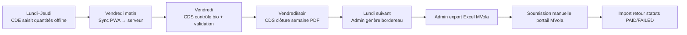

# ALTERRA — Compte-rendu atelier métier (cadrage documenté)

**Statut :** Cadrage documenté en attente de validation métier  
**Date de synthèse :** 21 juillet 2026  
**Sources :** Specs fonctionnelles/techniques détaillées, backlog V1, brief Chef de Projet  
**Participants prévus (non tenus) :** Référent Admin ALTERRA, 1–2 Chefs de Service, PO NextA, Tech Lead

---

## 1. Contexte et objectif

L'atelier métier prévu (2–3 demi-journées, UC-CAD-01) vise à figer le workflow opérationnel réel d'ALTERRA : cycle campagne, règles biométriques, format MVola, rythme de validation et de paiement. En l'absence de session live avec les parties prenantes, ce document synthétise les hypothèses issues des specs existantes et liste les questions ouvertes à valider en atelier.

---

## 2. Workflow opérationnel retenu (hypothèse V1)

### 2.1 Cycle campagne

| Élément           | Hypothèse documentée                                | Source                  |
| ----------------- | --------------------------------------------------- | ----------------------- |
| Durée campagne    | 1er juillet → 30 juin                               | RG-14                   |
| Sites actifs      | 5 sites simultanés                                  | Spec fonctionnelle §1.2 |
| Volumétrie        | ~600 MOC actifs, jusqu'à 1 000/campagne             | Brief CP                |
| Rythme pointage   | Quotidien, à la tâche, par Chef d'Équipe (CDE)      | UC-08 à UC-11           |
| Rythme validation | Hebdomadaire, vendredi, par Chef de Service (CDS)   | UC-13 à UC-15           |
| Rythme paiement   | Hebdomadaire (Admin génère bordereau + Excel MVola) | UC-24 à UC-27           |

### 2.2 Chaîne de valeur hebdomadaire

### 2.3 Rôles et périmètres

| Rôle                  | Effectif     | Périmètre données             | Interface             |
| --------------------- | ------------ | ----------------------------- | --------------------- |
| Administrateur        | 1            | Tous sites                    | Web App Admin         |
| Chef de Service (CDS) | 5 (1/site)   | Son site uniquement (RG-05)   | PWA mode validation   |
| Chef d'Équipe (CDE)   | 15 (~3/site) | Son équipe uniquement (RG-06) | PWA mode pointage     |
| MOC                   | ~600         | Non utilisateur direct        | Bénéficiaire paiement |

---

## 3. Règles biométriques (hypothèse V1)

| Règle              | Description                                                                                                                                      | Statut          |
| ------------------ | ------------------------------------------------------------------------------------------------------------------------------------------------ | --------------- |
| RG-03              | Bio **OK** requis avant validation pointage et inclusion bordereau ; **aucune ligne exportée MVola bulk sans bio OK** ; DOUBT/KO/absent bloquent | Documenté       |
| Moment du contrôle | Vendredi, convocation MOC au camp, photo prise par CDS                                                                                           | UC-14           |
| Provider V1        | Adapter interchangeable : Mock / Manual / AXIAN (env `BIOMETRIC_PROVIDER`)                                                                       | UC-BE-BIO-ADAPT |
| Seuils             | OK ≥ seuil, DOUBT entre 0.5 et seuil, KO < 0.5                                                                                                   | UC-14           |
| Stockage photo V1  | Photo non stockée après envoi AXIAN                                                                                                              | UC-14           |
| Mode dégradé       | Si AXIAN indisponible → override manuel **Admin** (motif + audit, BIO-503) ; **hors export bulk MVola**                                          | Spec erreurs §9 |
| Colonne Excel      | « Bio Validée » : `OUI` uniquement en export bulk ; `NON` / `N/A` = statuts internes ALTERRA, jamais exportés                                    | §7.4            |

**Dépendance externe :** Engagement AXIAN (API Key, sandbox, doc) à formaliser avant Sprint 4 (biométrie).

---

## 4. Règles MVola et paiement (hypothèse V1)

| Règle                | Description                                                              | Source                |
| -------------------- | ------------------------------------------------------------------------ | --------------------- |
| Mode paiement        | Jamais par API ; fichier Excel Bulk Transfer soumis manuellement         | Spec v3 §1.2          |
| Agrégation           | Somme(quantité × tarif snapshot) par MOC, pointages VALIDATED uniquement | UC-24, RG-01          |
| Format export        | 5 colonnes : Téléphone, Description, Période, Montant, Bio Validée       | §7.4                  |
| Description          | « Prénom Paiement Code_site », tronquée ~30 car. (RG-09)                 | RG-09                 |
| Période              | Sxx (semaine ISO) ou Dxxx (jour) selon cycle retenu (RG-10)              | RG-10                 |
| Import retour        | Match numéro MVola + montant → PAID / FAILED                             | UC-27                 |
| Codes sites paiement | MNK, ANJ, etc. (3 lettres)                                               | Spec v3 tableau sites |

**Dépendance externe :** Échantillon fichier MVola Bulk Transfer réel non disponible à ce jour (voir `mvola-format.md`).

---

## 5. Processus pointage et validation

### 5.1 Saisie CDE (offline-first)

1. Sélection activité du jour (cache local obligatoire si offline).
2. Saisie en lot ~40 MOC : quantité numérique, recherche instantanée, quantité par défaut applicable.
3. Enregistrement IndexedDB avec `clientUuid` (RG-02 idempotence).
4. Sync auto 60 s ou manuelle, batch ≤ 100.

### 5.2 Validation CDS

1. Consultation pointages semaine, groupés par équipe.
2. Contrôle biométrique par MOC (photo → AXIAN ou manuel).
3. Validation unitaire ou rejet avec motif obligatoire.
4. Clôture semaine → PDF rapport + facture + signature électronique → email Admin.

### 5.3 Corrections Admin

- Correction pointage : motif obligatoire, audit complet (RG-07).
- Modification ligne paiement : nouveau montant + motif (UC-25).

---

## 6. Décisions de cadrage proposées (à valider)

| #   | Décision                     | Proposition                                                             | Impact                    |
| --- | ---------------------------- | ----------------------------------------------------------------------- | ------------------------- |
| D1  | Période paiement V1          | Semaine ISO (Sxx) uniquement ; clôture quotidienne (Dxxx) reportée V2   | Export MVola, UC-22       |
| D2  | Composition équipes V1       | Admin crée équipes et affecte MOC ; pas de composition CDS en V1        | UC-07 reporté V2          |
| D3  | Création MOC V1              | Admin uniquement (pas de workflow demande CDS)                          | UC-05 vs UC-FE-PWA-WKRREQ |
| D4  | Auth CDE V1                  | Email + mot de passe (OTP SMS optionnel / reporté)                      | UC-01                     |
| D5  | Provider biométrique initial | Mock en dev, Manual en recette si AXIAN absent                          | Sprint 4                  |
| D6  | MFA Admin                    | **TOTP obligatoire pour comptes Admin** (Must V1) ; recommandé pour CDS | UC-BE-AUTH                |

---

## 7. Questions ouvertes pour l'atelier métier (top 5 prioritaires)

| ID       | Question                                                                                              | Responsable validation | Priorité                             |
| -------- | ----------------------------------------------------------------------------------------------------- | ---------------------- | ------------------------------------ |
| Q-PAY-01 | Fournir un échantillon réel fichier Bulk Transfer (export + retour)                                   | Admin                  | **Critique S1** — condition Sprint 1 |
| Q-BIO-02 | Contact AXIAN et disponibilité sandbox avant quand ?                                                  | Admin / CP             | **Haute** — dépendance Sprint 4      |
| Q-WF-03  | Que faire des MOC absents vendredi (bio non faite) : report semaine suivante ou mode dégradé audité ? | Admin                  | **Haute** — impact RG-03             |
| Q-PAY-02 | Limite exacte caractères colonne Description MVola                                                    | Admin / MVola          | **Haute** — risque rejet export      |
| Q-REF-01 | Liste définitive des 5 sites + codes 3 lettres pour paiement                                          | Admin                  | **Haute** — référentiel bloquant     |

---

## 8. Prochaines étapes

| Action                                                 | Échéance                    | Owner         |
| ------------------------------------------------------ | --------------------------- | ------------- |
| Planifier atelier 1 (workflow + biométrie) — ½ journée | S1                          | PO            |
| Planifier atelier 2 (MVola + référentiels) — ½ journée | S1                          | PO            |
| Obtenir échantillon MVola Bulk Transfer                | Fin S1 (condition Sprint 1) | Admin ALTERRA |
| Valider décisions D1–D6                                | Post-atelier 1              | PO + Admin    |
| Mettre à jour specs si écarts constatés                | S2                          | Tech Lead     |

---

## 9. Annexes

### 9.1 Questions ouvertes secondaires (report atelier)

#### Workflow et calendrier

| ID      | Question                                                                                     | Responsable validation |
| ------- | -------------------------------------------------------------------------------------------- | ---------------------- |
| Q-WF-01 | Le paiement est-il strictement hebdomadaire ou certains sites paient-ils en fin de journée ? | Admin + CDS            |
| Q-WF-02 | Quel jour/heure exact pour la convocation biométrique vendredi ?                             | CDS                    |
| Q-WF-04 | Processus actuel papier/Excel : quelles étapes disparaissent vs conservées en parallèle ?    | Admin                  |
| Q-WF-05 | Qui signe la facture si le CDS est indisponible ?                                            | Admin                  |

#### Biométrie

| ID       | Question                                                                       | Responsable validation |
| -------- | ------------------------------------------------------------------------------ | ---------------------- |
| Q-BIO-01 | Seuil acceptable pour DOUBT : validation CDS motivée ou blocage systématique ? | Admin + CDS            |
| Q-BIO-03 | Photo MOC à l'embauche : qui la prend en V1 (Admin ou CDS) ?                   | Admin                  |
| Q-BIO-04 | MOC sans numéro MVola : peuvent-ils être payés autrement ou exclus ?           | Admin                  |

#### MVola et comptabilité

| ID       | Question                                                                             | Responsable validation |
| -------- | ------------------------------------------------------------------------------------ | ---------------------- |
| Q-PAY-03 | Traitement des échecs FAILED : régénération ligne seule ou nouveau fichier complet ? | Admin                  |
| Q-PAY-04 | Montant minimum/maximum par transfert MVola                                          | Admin                  |
| Q-PAY-05 | Un MOC peut-il avoir plusieurs numéros MVola dans le temps ?                         | Admin                  |

#### Référentiels et données

| ID       | Question                                                                  | Responsable validation |
| -------- | ------------------------------------------------------------------------- | ---------------------- |
| Q-REF-02 | Liste activités et tarifs campagne en cours (trouaison, défrichage, etc.) | Admin                  |
| Q-REF-03 | Format fichier Excel import MOC initial (colonnes obligatoires)           | Admin                  |
| Q-REF-04 | Répartition équipes/MOC par site pour campagne pilote                     | CDS                    |

#### Adoption terrain

| ID      | Question                                                                 | Responsable validation |
| ------- | ------------------------------------------------------------------------ | ---------------------- |
| Q-UX-01 | Modèles smartphones CDE cibles (Android, version Chrome)                 | CDS                    |
| Q-UX-02 | Langue interface : français uniquement ou malgache pour labels terrain ? | Admin + CDS            |
| Q-UX-03 | Site pilote recette V1 : lequel ?                                        | Admin                  |

### 9.2 Références documentaires

- Spec fonctionnelle détaillée : `basedocs/ALTERRA - Spécification fonctionnelle détaillée.md`
- Spec technique détaillée : `basedocs/ALTERRA - Spécification technique détaillée.md`
- Backlog V1 : `basedocs/ALTERRA - Backlog détaillé.md`
- MoSCoW V1 : `docs/cadrage/backlog-moscow.md`
- Wireframes écrans clés : `docs/cadrage/maquettes-figma-liens.md`
- Format MVola : `docs/cadrage/mvola-format.md`

---

_Document généré par synthèse documentaire — à remplacer par un CR signé après atelier(s) réel(s)._
