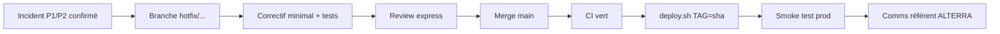

# Hypercare V1 — support post-MEP (3 semaines)

**Use case :** `UC-OPS-HC`  
**Durée :** J+1 à J+21 après MEP production  
**Objectif :** absorber les incidents terrain sans dégrader la campagne ni la confiance utilisateurs

Documents liés :

- Runbook exploitation : [docs/runbook.md](../runbook.md)
- Déploiement : [docs/deploy/production.md](../deploy/production.md)
- Recette : [docs/qa/recette-v1.md](../qa/recette-v1.md)
- Registre incidents : [incident-register.md](incident-register.md)
- Bilan hebdo : [weekly-bilan-template.md](weekly-bilan-template.md)

---

## 1. Périmètre hypercare

| Inclus | Exclus (→ backlog V2 ou contrat maintenance) |
|--------|------------------------------------------------|
| Bugs bloquants P1/P2 | Nouvelles fonctionnalités |
| Hotfix prod (< 4 h cible P1) | Refonte UX majeure |
| Ajustements UX mineurs (< 0,5 j) | Intégrations non prévues V1 |
| Support astreinte réactive | Formation sites supplémentaires |
| 3 réunions bilan hebdomadaire | Évolution NFC, workflows demandes |

---

## 2. Astreinte (Step 1)

### 2.1 Organisation

| Rôle | Responsabilité | Disponibilité |
|------|----------------|---------------|
| **Astreinte technique** (NextA) | Incidents infra, API, déploiement | 08h–20h jours ouvrés + best effort soir/week-end P1 |
| **Référent métier** (ALTERRA) | Priorisation, communication sites | Heures bureau |
| **Admin système site** | Première ligne terrain | Téléphone campagne |

**Canaux :**

1. Téléphone astreinte (numéro à renseigner avant MEP)
2. Canal Slack / WhatsApp projet (incidents non bloquants)
3. Email `support@…` (tracé, délai réponse 4 h ouvrées)

### 2.2 Calendrier type

| Semaine | Focus |
|---------|-------|
| S1 post-MEP | Stabilisation login, sync, saisie lot ; présence terrain renforcée |
| S2 | Paiements MVola, validation CDS, volumétrie réelle |
| S3 | Consolidation, clôture anomalies, préparation sortie hypercare |

### 2.3 Prise d'appel

1. Qualifier sévérité (voir §3)
2. Créer entrée dans [incident-register.md](incident-register.md)
3. Si P1 : notifier référent métier + lancer hotfix si confirmé
4. Si contournement possible : documenter workaround dans le registre

---

## 3. Grille de sévérité

| Niveau | Définition | Délai prise en charge | Délai résolution cible |
|--------|------------|----------------------|------------------------|
| **P1** | Campagne arrêtée, perte de données, paiement bloqué | 30 min | 4 h (hotfix ou rollback) |
| **P2** | Fonction dégradée avec contournement pénible | 2 h | 24 h |
| **P3** | Cosmétique, doc, question utilisateur | J+1 ouvré | Sprint suivant |

**Exemples P1 :** sync impossible 100 % CDE, admin inaccessible, corruption base, fuite données.  
**Exemples P2 :** bio lent, export MVola partiel, KPI admin incorrect.  
**Exemples P3 :** libellé UI, typo guide, demande formation.

---

## 4. Hotfix (Step 2)

### 4.1 Workflow



### 4.2 Commandes

```bash
# Sur poste dev
git checkout -b hotfix/2026-07-XX-description
# … correctif …
npm test -w backend && npm run test:e2e

# Sur serveur prod
cd /opt/alterra/infra
TAG=<git-sha-hotfix> GHCR_IMAGE_PREFIX=ghcr.io/VOTRE_ORG/alterra ./scripts/deploy.sh
```

### 4.3 Rollback si hotfix aggrave

```bash
TAG=<sha-precedent> ./scripts/rollback.sh
```

> Un rollback ne revert **pas** les migrations Prisma post-tag. En cas de migration breaking → [restore.sh](../../infra/scripts/restore.sh) sur staging d'abord.

### 4.4 Critères de sortie hotfix

- [ ] CI vert (lint, test backend, build, e2e)
- [ ] Smoke test prod OK
- [ ] Entrée registre incidents mise à jour (statut Résolu)
- [ ] Référent métier informé

---

## 5. Ajustements UX mineurs (Step 3)

Autorisés sans cadrage V2 si **≤ 0,5 j-h** et **sans impact schéma DB** :

- Libellés, messages d'erreur clarifiés
- Ordre champs, focus clavier
- Seuils timeout affichés
- Aide contextuelle (tooltip)

**Process :**

1. Ticket avec capture écran + rôle utilisateur
2. Validation référent ALTERRA (email ou bilan hebdo)
3. PR normale (pas forcément branche hotfix sauf P2)
4. Déploiement prochain `deploy.sh` planifié ou hotfix si couplé P2

---

## 6. Réunion hebdomadaire bilan (Step 4)

**Fréquence :** 1 × / semaine pendant hypercare (30–45 min)  
**Participants :** référent ALTERRA, astreinte technique, admin système (optionnel)

**Ordre du jour :** utiliser [weekly-bilan-template.md](weekly-bilan-template.md)

**Livrables par réunion :**

- Registre incidents à jour
- Liste anomalies ouvertes / fermées
- Décision go/no-go poursuite campagne
- Points alimentant [retrospective-v1.md](../retrospective-v1.md) (Task 26)

---

## 7. Sortie hypercare (fin semaine 3)

| Critère | Seuil |
|---------|-------|
| P1 ouverts | 0 |
| P2 ouverts | ≤ 2 avec plan daté |
| Sync terrain | > 95 % lots sync J+0 sur site pilote |
| MVola | 1 cycle export/import réussi en prod |
| Formation | PV recette signé |

**Passage maintenance long terme :** voir contrat infogérance (hors périmètre firm 50 j-h V1).

---

## 8. Contacts (à compléter avant MEP)

| Rôle | Nom | Téléphone | Email |
|------|-----|-----------|-------|
| Astreinte technique | | | |
| Référent ALTERRA | | | |
| Admin système | | | |

---

*Task 25 — OPS-HYPERCARE · ALTERRA V1*
